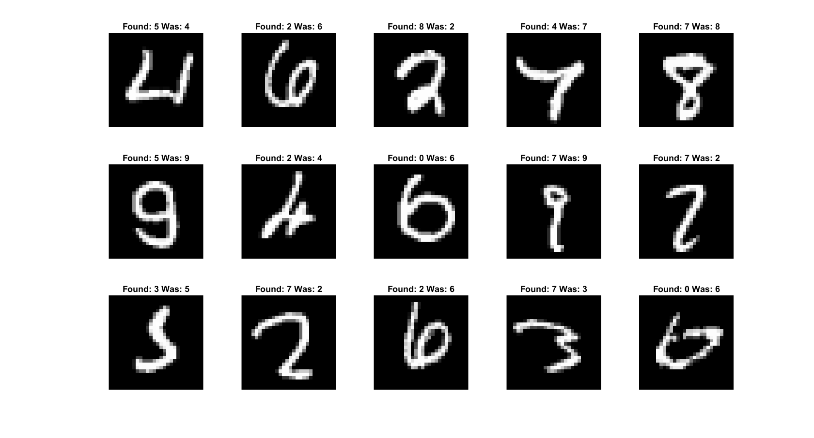

# MLP from scratch
Multilayer Perceptron implementation from scratch in Matlab

<p align="center">
  
</p>


This repository is an effort to build an MLP from scratch. The model is trained using gradient descent and it supports batch training.
It is not guaranteed to produce the best results and can not be compared to famous libraries such as
[tensorflow](https://www.tensorflow.org/) or [torch](http://torch.ch/). It was made for educational purposes. To test the code,
I used the [MNIST](http://yann.lecun.com/exdb/mnist/) dataset (digits 0-9), but the code is general so that the neural network can be trained
on any dataset. To read the data in matlab these [mnistHelper functions](http://ufldl.stanford.edu/wiki/index.php/MATLAB_Modules)
were helpful. I would appreciate any bug report, any correction on the code, or any suggestion to improve this repository.

## Index

[Files explained](#files-explained)

[How to build the MLP](#how-to-build-the-mlp)

[Visualizations](#visualizations)

## Files explained

- **Main**
  - [mynn.m](/mynn.m)
   
   Here we read the input dataset, train the neural network, test it to find the precision, plot the curve of the training
   and testing error and the curve of the training and testing accuracy and save the model ([nn_model.mat](/nn_model.mat)).
   For this dataset that was used,  because it is with images I added some extra features for visualization. The first one is
   to show some of the wrong predictions in images. Then we show the image of every neuron of every layer which image is created
   by calculating how much each pixel is affected by the input (see [Visualizations](#visualizations)). Then there is an example image ([num.jpg](/num.jpg))
   that is fed into the neural network and it tries to find what digit it shows.
   
- **Functions for the input**
  - [readMNISTImages.m](/readMNISTImages.m)
  - [readMNISTLabels.m](/readMNISTLabels.m)
  - [labels2goals.m](/labels2goals.m)
  
  In order to read the input samples for training ([train-images.idx3-ubyte](/train-images.idx3-ubyte)) and testing
  ([t10k-images.idx3-ubyte](/t10k-images.idx3-ubyte)) we use the ``readMNISTImages`` function, whereas in order to read the
  labels of the input samples for training ([train-labels.idx1-ubyte](/train-labels.idx1-ubyte)) and testing
  ([t10k-labels.idx1-ubyte](/t10k-labels.idx1-ubyte)) we use the ``readMNISTLabels`` function. Now the labels are a number for
  every input, which is the digit show in the input image, so in order to convert this to a vector with desired values for the
  output neurons we use the ``labels2goals``.
    
  
- **Activation functions**
  - [phi.m](/phi.m)
  - [phi_d.m](/phi_d.m)
  
  These 2 functions accept 2 parameters, one (``x``) for the value that we want to pass through our activation function and
  one (``activation_function``) for specifying which activation function to be used. Currently only the hyperbolic tangent
  (``'tanh'``), the sigmoid (``'sigmoid'``) and the ReLU (``'relu'``) functions are supported. The ``phi_d`` function is for
  calculating the derivative of the activation function.
  
  

## How to build the MLP

```Matlab
% ===== Inputs ===== %

train_set_inputs = readMNISTImages('train-images.idx3-ubyte')';
train_labels = readMNISTLabels('train-labels.idx1-ubyte');
train_set_goals = labels2goals(train_labels, 10);
test_set_inputs = readMNISTImages('t10k-images.idx3-ubyte')';
test_labels = readMNISTLabels('t10k-labels.idx1-ubyte');
test_set_goals = labels2goals(test_labels, 10);

hidden_layers_sizes = [32 16];
activation_function = 'tanh';
number_of_epochs = 10;
learning_rate = 0.01;
batch_size = 1;
```
#### Variables needed:
- **train_set_inputs, test_set_inputs** (2D matrix with the vector of an input sample in each row)
- **train_set_goals, test_set_goals** (2D matrix with the desired values of the output neurons of the corresponding input)
- **hidden_layers_sizes** (a vector with the number of neurons on every hidden layer)
- **activation_function** (string with the activation function that will be used now supported: 'tanh', 'sigmoid', 'relu')
- **number_of_epochs** (how many epochs for the training)
- **learning_rate** (the learning rate for the training)
- **batch_size** (the size of each batch while training)


## Visualizations

For the visualizations I used the model that we built [above](#how-to-build-the-mlp) whith these parameters:
- Structure: 784(input-layer)**x**32(hidden-layer-1)**x**16(hidden-layer-2)**x**10(output-layer)
- Activation function: tanh
- Epochs: 10
- Learning rate: 0.01
- Batch size: 1

This model produced a precision of **95.61%**.

The precision curves (for train set and test set) through the 10 epochs:

The error curves (for train set and test set) through the 10 epochs:

15 wrong predictions of the model:

How much each neuron from the first hidden layer is affected by the input:

How much each neuron from the second hidden layer is affected by the input:

How much each neuron from the output layer is affected by the input:


